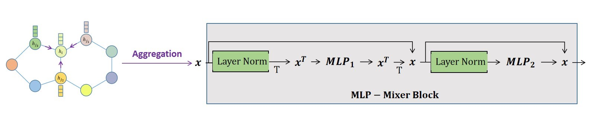

# Graph Nasreddin Networks

<p align="center">
  <a href="https://arxiv.org/abs/2301.12493"></a>
  <a href="https://github.com/asarigun/GraphMixerNetworks/blob/master/LICENSE"></a>
  <a href="https://www.reddit.com/r/MachineLearning/comments/10sj2qf/r_graph_mixer_networks/?utm_source=share&utm_medium=web2x&context=3"></a>
</p>

> *In this model, we try to use MLP-Mixer in Graph Neural Networks. The motivation for this project is to replace Transformers and Message Passing with MLP-Mixers in Graph Neural Nets*

Check out our paper below for more details

> [**Graph Mixer Networks**](https://arxiv.org/abs/2301.12493),            
> [Ahmet Sarıgün](https://asarigun.github.io/)     
> *Arxiv, 2023*

<p align="center"></p>

## Overview

* ```geometric_linear.py```: **Linear Layer from PyG Source Code** for Graph Nasreddin Networks
* ```gmn_layer.py```: **Graph Nasreddin Layer** 
* ```gmn_train_zinc.py```: **Graph Nasreddin Network** Training on ZINC Dataset

## Usage
```bash
python gmn_train_zinc.py
```

## License

[MIT](LICENSE)

## Acknowledgement

The name of the **Nasreddin** coming from Anatolian figure Nasreddin Hodja's story called **'What if it happens?'**. Also, while doing benchmarking, we use the **[PNA](https://arxiv.org/pdf/2004.05718.pdf)** paper implementation in **[PyTorch Geometric](https://github.com/pyg-team/pytorch_geometric/blob/master/examples/pna.py)**. Special thanks to authors for sharing code!

You can find the story behind the Graph Mixer Nets [**here!**](https://www.reddit.com/r/MachineLearning/comments/10sj2qf/r_graph_mixer_networks/?utm_source=share&utm_medium=web2x&context=3)

## Citation

```bibtex
@article{sarigun2023graph,
  title={Graph Mixer Networks},
  author={Sar{\i}g{\"u}n, Ahmet},
  journal={arXiv preprint arXiv:2301.12493},
  year={2023}
}
```
